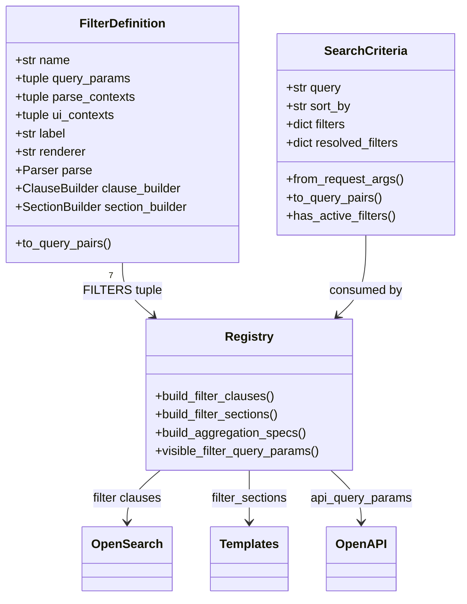
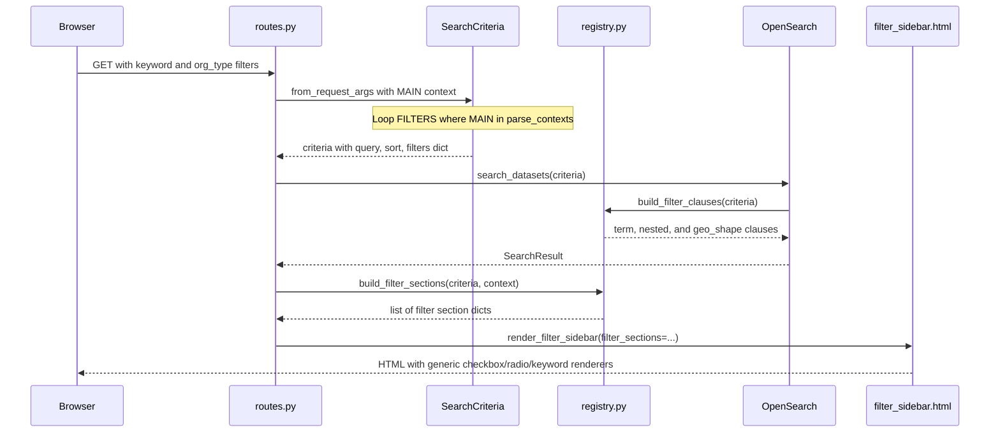
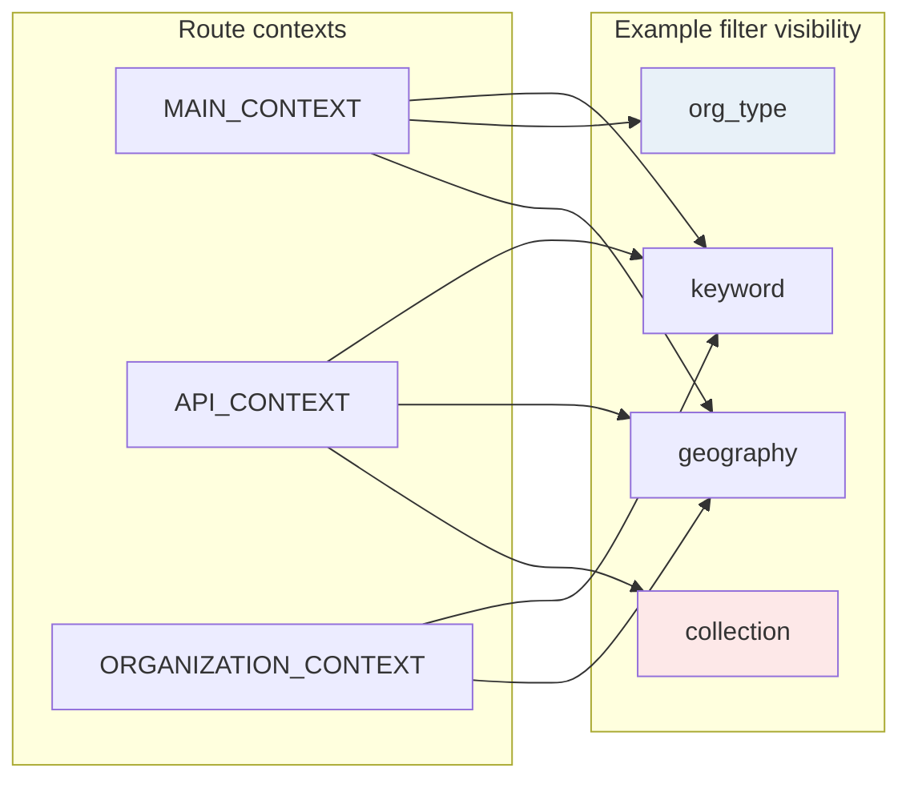
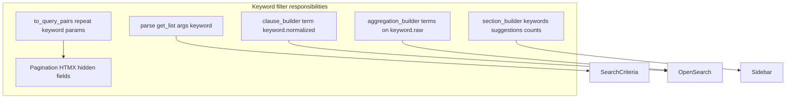
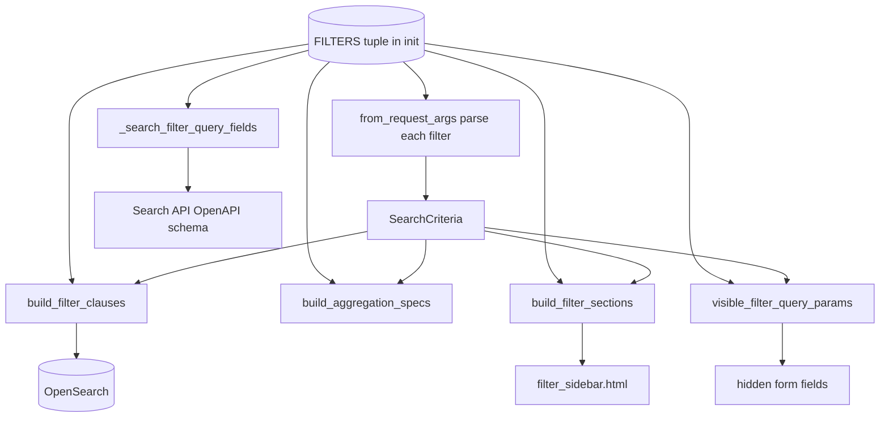
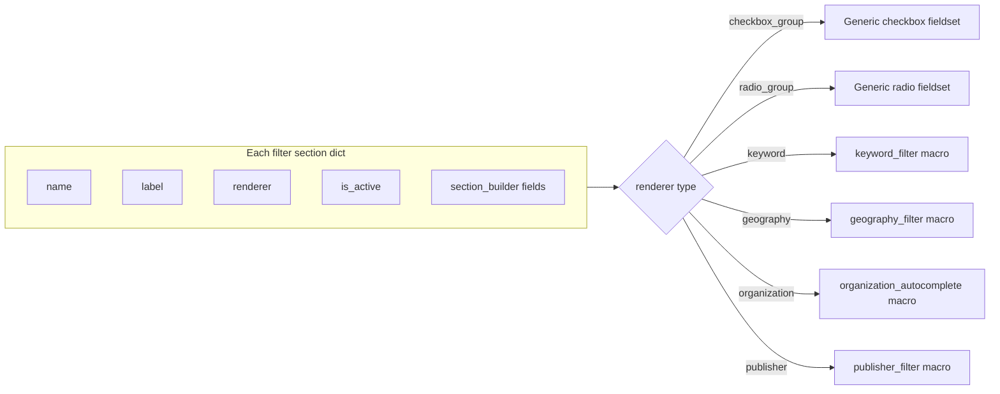
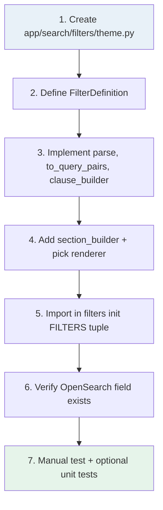

# Search Filters Refactor

> **Branch:** `5834-improve-search-builder`  
> **Audience:** developers working on search, filters, or OpenSearch queries  
> **Companion:** [How To Add Search Filters](./search-filters.md)

A progressive walkthrough of how dataset search filters work **now**, why the architecture changed, and how the new design makes the system easier to understand and extend.

---

## Contents

| Step | Topic |
|:----:|-------|
| 1 | [What changed at a glance](#step-1--what-changed-at-a-glance) |
| 2 | [Why we changed it](#step-2--why-we-changed-it) |
| 3 | [Core concept](#step-3--the-core-concept-one-filter-one-definition) |
| 4 | [End-to-end request flow](#step-4--end-to-end-request-flow) |
| 5 | [Inside a filter module](#step-5--inside-a-filter-module) |
| 6 | [Registry loops](#step-6--the-registry-four-loops-one-source-of-truth) |
| 7 | [UI rendering](#step-7--ui-generic-sidebar-driven-by-filter_sections) |
| 8 | [API & OpenAPI](#step-8--api--openapi-stay-in-sync-automatically) |
| 9 | [Adding a new filter](#step-9--how-to-add-a-new-filter-eg-theme) |
| 10 | [What you gain](#step-10--what-you-gain) |

---

## Step 1 — What changed at a glance

Search filters used to be **scattered**: each route parsed its own query parameters, OpenSearch built filter clauses inline, the sidebar hard-coded which filters to show, and OpenAPI docs were maintained separately.

Now, each filter is a single **registered definition** that owns parsing, URL serialization, OpenSearch clauses, optional aggregations, sidebar rendering metadata, and API documentation — all in one place under `app/search/filters/`.

### Before vs. after

| Before | After |
|--------|-------|
| `routes.py` — manual `request.args.getlist("keyword")` etc. | `SearchCriteria` — one object parsed from the request |
| `opensearch.py` — 80+ lines of inline filter clause building | `FilterDefinition` — one module per filter (7 today) |
| `filter_sidebar.html` — per-filter flags like `show_org_type_filters` | `registry.py` — loops over `FILTERS` for clauses, UI, aggs |
| `api_schemas.py` — hand-written query fields per filter | `docs/search-filters.md` — how to add a new filter in ~6 steps |

> [!IMPORTANT]
> **One-sentence summary:** Filters went from *"copy the same plumbing in four files"* to *"declare a filter once, register it, and every layer picks it up."*

---

## Step 2 — Why we changed it

The old design worked, but every new filter (or tweak) touched many unrelated places.

| Concern | Old pain | New approach |
|---------|----------|--------------|
| **Parsing** | Duplicated in index route, org detail route, and `/search` API | `SearchCriteria.from_request_args()` iterates registered filters |
| **OpenSearch** | Long `if keywords / if org_types / if publisher …` block inside `search()` | `build_filter_clauses(criteria)` calls each filter's `clause_builder` |
| **URL preservation** | Manual hidden inputs and pagination query dicts per route | `criteria.to_query_pairs()` and `to_query_dict()` |
| **Sidebar UI** | Template macros called with many individual variables | `build_filter_sections()` returns a uniform list of sections |
| **OpenAPI** | Fields added manually to `SearchQuery` | Generated from each filter's `api_query_params` |
| **Context rules** | Implicit — "org type only on main search" buried in route logic | Explicit — `parse_contexts` and `ui_contexts` on each filter |

### Before: filter logic lived in OpenSearch

```python
# app/database/opensearch.py (old)
filters = []
if keywords:
    for keyword in keywords:
        filters.append({"term": {"keyword.normalized": keyword.lower()}})
if org_id is not None:
    filters.append({"nested": {"path": "organization", ...}})
if org_types:
    filters.append({"nested": {"path": "organization", ...}})
if publisher:
    filters.append({"term": {"publisher.normalized": publisher.lower()}})
if spatial_filter == "geospatial":
    filters.append({"term": {"has_spatial": True}})
# ... more filters ...
```

### After: OpenSearch delegates to the registry

```python
# app/database/opensearch.py (new)
filters = build_filter_clauses(criteria)
if filters:
    search_body["query"] = {"bool": {"filter": filters, "must": [base_query]}}
```

---

## Step 3 — The core concept: one filter, one definition

Each filter is a frozen `FilterDefinition` dataclass. Think of it as a contract that answers five questions for the rest of the app:

1. **What query params do I own?** → `query_params`
2. **How do I parse them from a request?** → `parse`
3. **How do I put them back in URLs?** → `to_query_pairs`
4. **How do I constrain OpenSearch?** → `clause_builder`
5. **How do I appear in the sidebar?** → `renderer` + `section_builder`

### Architecture



> [!NOTE]
> Registered filters today: **Geography**, **Keyword**, **Organization**, **Organization Type**, **Publisher**, **Spatial Data**, **Collection** — see `app/search/filters/__init__.py`.

---

## Step 4 — End-to-end request flow

Follow a search request from the browser through to results. The same `SearchCriteria` object travels through every layer.



### Route contexts control where a filter applies

Not every page needs every filter. Three constants gate behavior:

| Context | Where |
|---------|-------|
| `MAIN_CONTEXT` | Homepage search (`/`) |
| `API_CONTEXT` | JSON search API (`/search`) |
| `ORGANIZATION_CONTEXT` | Organization detail search |



> [!TIP]
> **Example:** `org_type` parses on main + API but only renders in the main sidebar. `collection` parses for API/main but has no UI section.

---

## Step 5 — Inside a filter module

Let's walk through **Organization Type** — a representative `checkbox_group` filter. The whole file is ~75 lines and self-contained.

```python
# app/search/filters/organization_type.py (simplified)

def _clause(criteria, values: list[str]) -> dict:
    return {
        "nested": {
            "path": "organization",
            "query": {"terms": {"organization.organization_type": values}},
        }
    }

ORGANIZATION_TYPE_FILTER = FilterDefinition(
    name="org_type",
    query_params=("org_type",),
    parse_contexts=(MAIN_CONTEXT, API_CONTEXT),
    ui_contexts=(MAIN_CONTEXT,),
    label="Organization Type",
    renderer="checkbox_group",
    options=ORG_TYPE_OPTIONS,
    parse=lambda args: get_list(args, "org_type"),
    to_query_pairs=lambda values: [("org_type", v) for v in values],
    clause_builder=_clause,
    section_builder=_section,
)
```

### Keyword filter: same pattern, plus aggregations

Filters that power autocomplete also declare aggregation hooks:

- `aggregation_builder` — OpenSearch agg spec
- `aggregation_parser` — turns raw buckets into suggestion lists



### Geography filter: multi-param, complex value

Some filters own **multiple** query params and store a structured value (geometry + within/intersects + label). The definition still encapsulates all of it:

```
query_params=("spatial_geometry", "spatial_within", "geography_label")
parse         → {geometry, within, label}
to_query_pairs → serializes JSON geometry back to the URL
clause_builder → geo_shape WITHIN or INTERSECTS
```

### Resolved vs. raw filter values

The **organization** filter accepts `org_slug` in the URL but OpenSearch needs the organization's `id`. Routes resolve the slug and call `criteria.set_resolved_filter("organization", org_id)`. `build_filter_clauses` reads `resolved_filters` first.

---

## Step 6 — The registry: four loops, one source of truth

`app/search/registry.py` is thin on purpose. It doesn't know filter specifics — it only iterates `FILTERS`:

| Function | What it does | Used by |
|----------|--------------|---------|
| `build_filter_clauses` | Collect OpenSearch `filter` clauses from active filters | `opensearch.search()` |
| `build_aggregation_specs` | Build contextual agg block for suggestions | `opensearch.search()` |
| `parse_filter_aggregations` | Normalize agg buckets to keyword/org/publisher lists | `SearchResult` parsing |
| `build_filter_sections` | Produce sidebar section dicts for the current page | Routes → Jinja template |
| `visible_filter_query_params` | Params already shown as visible inputs (exclude from hidden fields) | Filter form hidden state |



---

## Step 7 — UI: generic sidebar driven by `filter_sections`

The sidebar template still uses specialized macros for complex controls (keyword autocomplete, geography map, organization lookup). But **which** sections appear and in what order is no longer hard-coded in routes.

<details>
<summary><strong>Before</strong> — routes passed many flags and individual values</summary>

```jinja
render_filter_sidebar(
    show_org_autocomplete=True,
    show_org_type_filters=True,
    keywords=keywords,
    org_types=org_types,
    publisher=publisher,
    spatial_filter=spatial_filter,
    ...
)
```

</details>

<details>
<summary><strong>After</strong> — routes pass one list; template dispatches by renderer</summary>

```jinja
render_filter_sidebar(
    filter_sections=build_filter_sections(criteria, route_context=MAIN_CONTEXT, ...),
    hidden_params=criteria.to_query_pairs(exclude=visible_filter_query_params(MAIN_CONTEXT)),
)
```

</details>

### Supported renderers

| Renderer | Used for |
|----------|----------|
| `checkbox_group` | Org type (and future theme, etc.) |
| `radio_group` | Spatial data yes/no/all |
| `keyword` | Keyword autocomplete + chips |
| `organization` | Organization autocomplete |
| `publisher` | Publisher autocomplete |
| `geography` | Geography search controls |



> [!NOTE]
> **Backward compatibility:** The template still supports the old individual-parameter path when `filter_sections` is `none`, so callers can migrate gradually.

---

## Step 8 — API & OpenAPI stay in sync automatically

`SearchQuery` in `api_schemas.py` is built dynamically from registered filters that include `API_CONTEXT` in `parse_contexts`:

```python
def _search_filter_query_fields():
    fields = {}
    for definition in FILTERS:
        if API_CONTEXT not in definition.parse_contexts:
            continue
        for param in definition.api_query_params:
            fields[param.name] = _api_query_field(param)
    return fields
```

Each filter's `ApiQueryParam` can declare `repeated=True`, `enum_values`, or special field types (e.g. JSON string for GeoJSON). Adding a filter with API support updates the schema without touching `api_schemas.py` field-by-field.

---

## Step 9 — How to add a new filter (e.g. Theme)

See [search-filters.md](./search-filters.md) for the full guide. The happy path:



```python
THEME_FILTER = FilterDefinition(
    name="theme",
    query_params=("theme",),
    parse_contexts=(MAIN_CONTEXT, API_CONTEXT, ORGANIZATION_CONTEXT),
    ui_contexts=(MAIN_CONTEXT, ORGANIZATION_CONTEXT),
    label="Theme",
    renderer="checkbox_group",
    options=THEME_OPTIONS,
    parse=lambda args: get_list(args, "theme"),
    to_query_pairs=lambda values: [("theme", v) for v in values],
    clause_builder=_clause,   # match_phrase on theme field
    section_builder=_section,
)
```

### You do **not** need to edit

- `routes.py` parsing (unless you need a resolved value like org slug → id)
- `opensearch.py` filter assembly
- Hidden field logic for pagination / clear filters
- OpenAPI query fields (if `api_query_params` is set)

---

## Step 10 — What you gain

### Easier to understand

- One file per filter — open `keyword.py` and see everything about keywords
- Explicit context rules instead of route conditionals
- `SearchCriteria` is the single vocabulary across routes, DB, and templates

### Easier to extend

- Add to `FILTERS` tuple → parsing, clauses, UI, and docs follow
- Generic renderers cover common patterns (checkbox/radio groups)
- Tests can target registry behavior once (`test_search_filter_registry.py`)

### Key files reference

| File | Role |
|------|------|
| `app/search/filters/base.py` | `FilterDefinition`, parsers, contexts |
| `app/search/filters/*.py` | Individual filter modules |
| `app/search/filters/__init__.py` | `FILTERS` registration order |
| `app/search/criteria.py` | `SearchCriteria` parse + serialize |
| `app/search/registry.py` | Loop helpers for DB, UI, aggs |
| `app/templates/components/filter_sidebar.html` | Renderer dispatch |
| `docs/search-filters.md` | Contributor how-to |

> [!TIP]
> **Next step:** Open `app/search/filters/keyword.py` side-by-side with this doc and trace one active filter from URL → criteria → OpenSearch clause → sidebar section. That single file is the mental model for all the others.

---

*Branch `5834-improve-search-builder` · data.gov catalog search filters*
