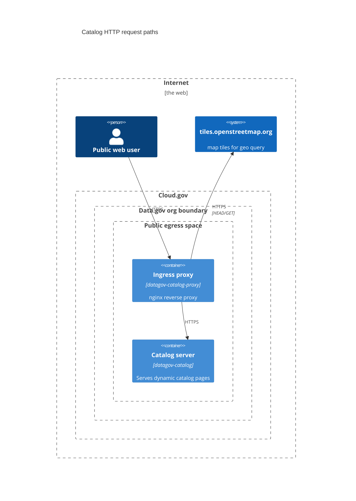
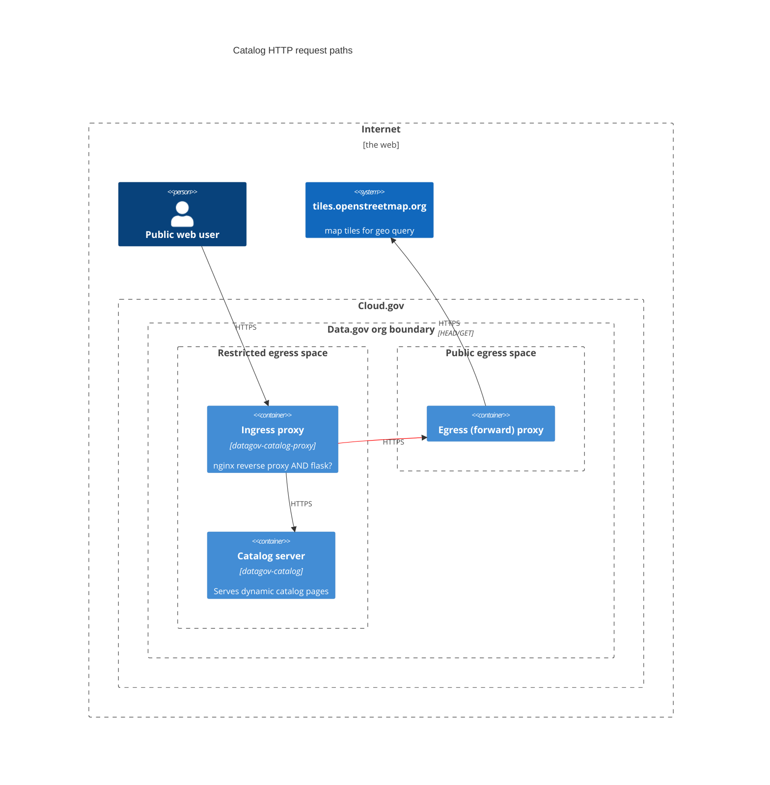

# Web proxy setup for catalog

We currently have a `proxy_pass` directed in nginx on the `datagov-catalog-proxy` app to serve map tiles from tiles.openstreetmap.org.

```
# use local path for map tiles so that they
# can be cached by the CDN
location /maptiles {
  # only allow requests generated from our apps
  valid_referers server_names *.data.gov *.app.cloud.gov;
  if ($invalid_referer) {
    return   403;
  }

  rewrite ^/maptiles/(.*)/(.*)/(.*).png$ /$1/$2/$3.png break;
  proxy_redirect off;
  proxy_pass https://tile.openstreetmap.org/;
}
```

As noted in the comment, serving the tiles images this way means they will be cached by our CDN.

## Current setup:

The current setup works because the ingress proxy (nginx) is hosted within a space with "public-egress" ASG.


## Desired setup:
We want the space with the catalog server (and its nginx proxy) in a restricted egress space. To do that, we need to send those openmaptiles.org requests through an egress proxy.

We could accomplish this in one of a few ways. In each of these, we would:
 - Change the ASG of the space `datagov.catalog` is in to "trusted-local-egress"
 - Add an egress proxy app. That app would be configured in exactly the same way as every other egress proxy the Data.gov system uses; we just need to make sure to add `tiles.openstreetmap.gov` to the allow list.
 - Launch the egress app in the existing `env-egress` space, which has the `public-egress` ASG.

### Approach 1: Ingress proxy app -> Egress proxy

This would be the obvious best choice *if only* nginx could be configured to do this. Unfortunately nginx isn't designed to make the handoff to a forward proxy. There are some mentions of people getting this to work where the forward proxy is a VPN, but those situations probably lacked some detail (e.g., proxy authentication) of our setup. Proxy authentication seems to be the hangup for us. Things that did not work:

 - Putting the entire egress proxy URL, including username:password, in the `proxy_pass` directive (along with adding the `Host` header "tiles.openstreetmap.org). Nginx startup fails with an "invalid port" error on the `proxy_pass` line; that syntax is not valid for that line.
 - Adding basic auth as an `Authorization` header, with just the host and port of the egress proxy in `proxy_pass`. This got a little further but the egress proxy returned `407 Proxy Authentication Required`.
 - Adding basic auth as a `Proxy-Authorization header instead of `Authorization`. Also no good; egress proxy returned a an error status (details?) and indicated that `Proxy-Authorization` was sent to soon.

So, although this diagram looks nice and simple, it adds a web server (probably a Flask application)  on the `datagov-catalog-proxy` app to act as an intermediary between nginx and the egress proxy. We know that we can use the `requests` library to make a request using an egress proxy.

Pros:
 - Keeps the intermediary proxy logically close to the nginx reverse proxy
 - Adds no load to the `datagov-catalog` app

Cons:
 - Two web servers running on one app (`datagov-catalog-proxy`); impure?



### Approach 2: Use the flask application that's already on datagov-catalog

In this scenario, `datagov-catalog-proxy` would pass openstreetmap requests to `datagov-catalog`, which would then make the request through an egress proxy server and return the response.

Pros:
 - No new app created
 - Uses existing flask application (`datagov-catalog`)

Cons:
 - Increases load on `datagov-catalog` (is this a concern?)


### Approach 3: Add an app for the intemediary hop

In this approach, we add a Flask application running on a separate Cloud.gov app to make the request via the egress proxy. This is the same as Approach 1, except that the new Flask application lives in a separate app, rather than running on the `datagov-catalog-proxy` app.

Pros:
 - Keeps HTTP servers logically separate
Cons:
 - Adds a new app


