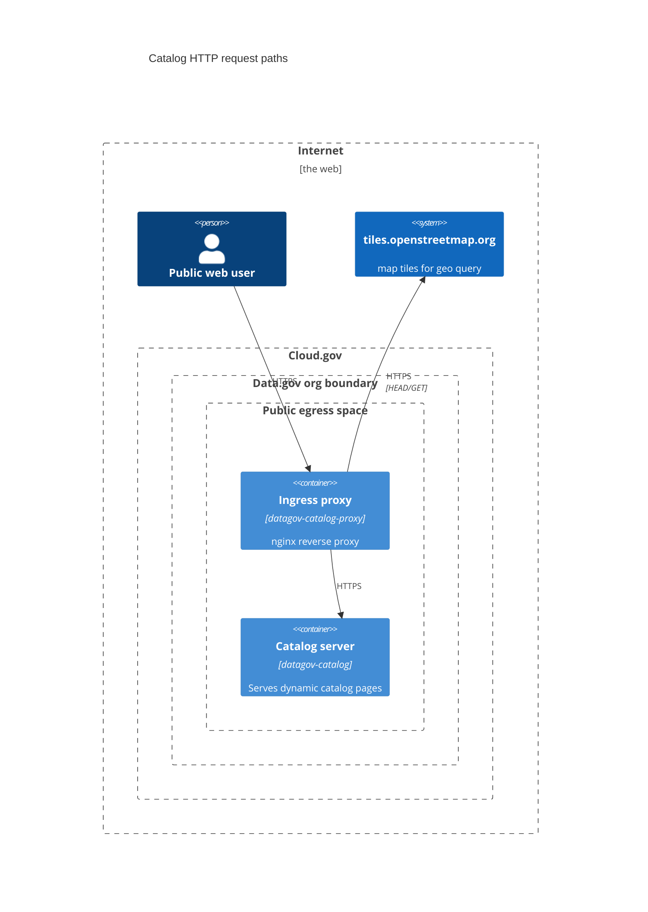
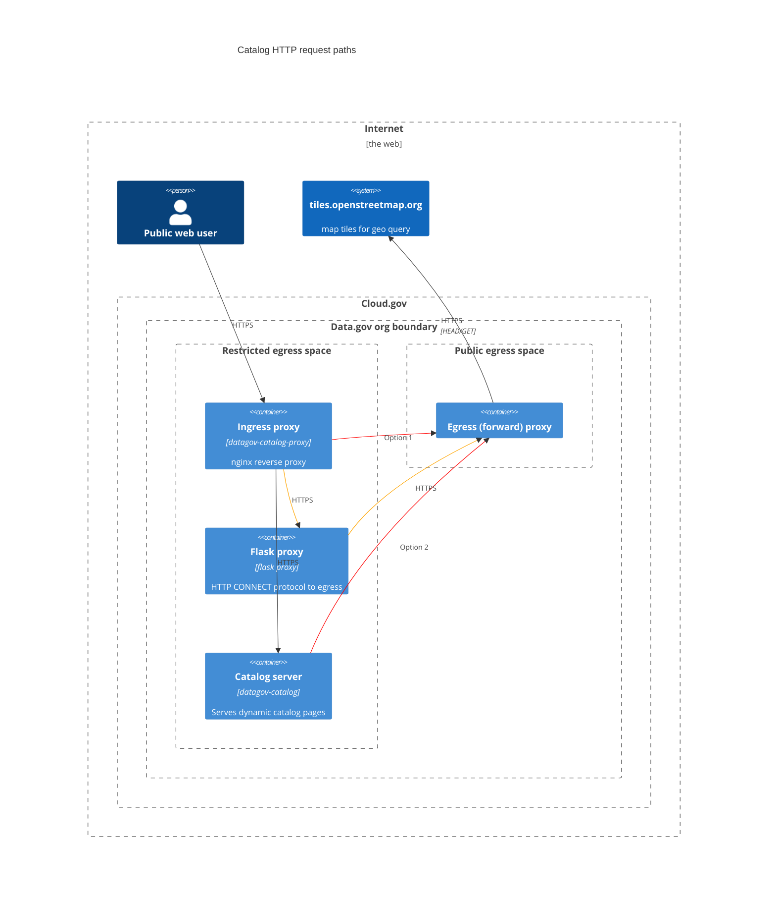

# Web proxy setup for catalog
Current setup:

We want the space with the catalog server (and its nginx proxy) in a restricted egress space. To do that, we need to send those openmaptiles.org requests through an egress proxy.

